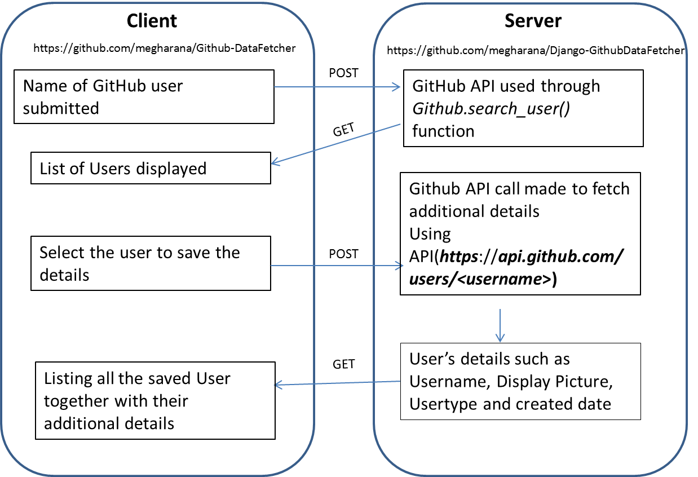

#Introduction
This project comprises of two components maintained in two different repositories (i.e.)
	
	Github-Datafetcher : controls the frontend part (https://github.com/megharana/Github-DataFetcher)
	DjangoGithubDataFetcher : supports backend process (https://github.com/megharana/Django-GithubDataFetcher)

#Technologies used:

	Framework : Django 2.0.6(coded in Python3)
	DB : dbsqlite3
	UI : Vue JS
	Additional Concepts Used : Celery 3.1.18 , Django Rest Framework 3.8.2 (handling GET and POST request)

#Data Flow Diagram:

	

For accessing Github API and for performing Git operations over HTTPS, a Personal Access Token(OAuth access Token) is created.
